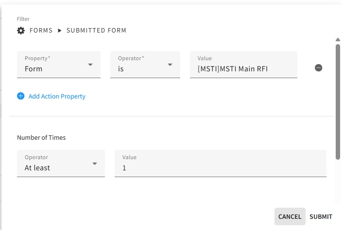
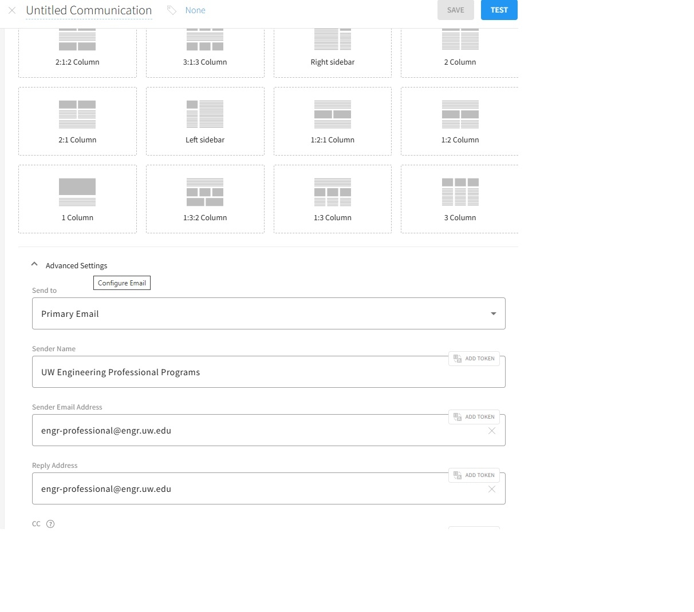
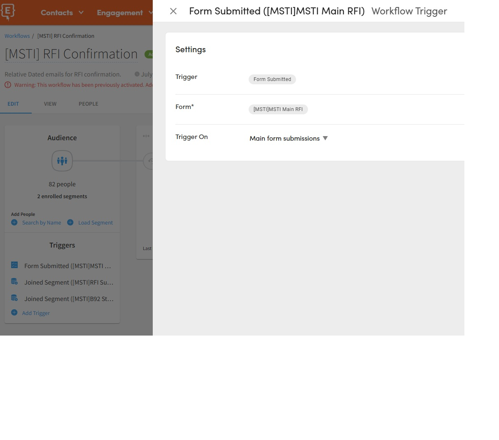
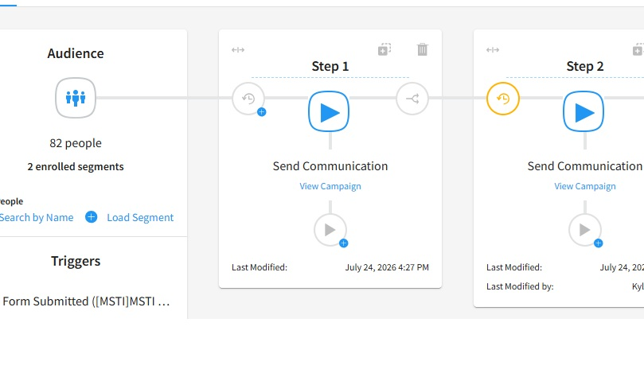

# Build an Intake Form

Relevant Element Modules:

Data Sources:https://help.element451.com/en/collections/3846538-data-sources

Field Management: https://help.element451.com/en/collections/3846539-field-management

Create Forms: https://help.element451.com/en/articles/9001082-creating-managing-forms

Campaigns: https://help.element451.com/en/collections/124581-campaigns

Workflows: https://help.element451.com/en/collections/124560-workflows-rules

### Goals:
1. Build a Form and the associated Data Fields
2. Make a Segment
3. Send an automated email once the form is submitted

## What do I use an intake form for?

Intake forms are a great way to capture engagement and quickly and professionally communicate with them.

In this example we will build an intake form, make sure the data is structured correctly, put users into segments, and enroll the person to get an immediate, customized email response.

You can further develop these leads by using workflows to enroll them into other email campaigns.

## Step 1: Determine what information to collect and determine if new Data Sources are needed.

Most common form fields are likely already mapped to Data Sources.  If you need a new Data Source, please check out the [Data Source article](/Data_Sources/Create Data Sources.md)

> [!WARNING]
> Most form field choices, if used in multiple forms, will overwrite with the latest submission.

For example, If you use the  '[COE] How did you hear about us' field on multiple forms, the most recent submission will overwrite any previous submissions.

## Step 2: Create a new form

Decide what form fields you need to populate. Please read <a href="/Forms/Create Forms">Create Forms</a> for tips to make sure your form functions correctly in the UW instance.

> [!NOTE] 
> Recommended practice: Consider a balance between amount of information you need at this stage, and ease of completing the form.  Shorter initial forms will get more engagement.

## Step 3: Create a Segment

Segments are how you sort and filter users. In order take any actions like sending an email or automation steps, you must create a segment that will be the target of any actions.

>[!TIP]
> Label one-time use segments with a specific label, so you can easily find and delete them later.  For example you may want to send a follow-up to people who attended a specific one time event. Consider deleting segments if they're no longer needed.

You can make segments based on actions that users take within Element:
* Registered for or attended an event
* Did not show for an appointment
* Submitted your RFI form

In this case, since submission of the RFI is done within Element, we can use the 'submitted form' filter to point to your specific form that was created above.

### Other ways to make a segment

You can also make segments based on data that you have imported:
* Started but not submitted applications
* A list of leads
* Leads from digital advertising
* People who have not accepted their admissions offer

For imported people you will need to identify them somehow by identifying a field to serve as a filter.  While you can also create audiences from imports directly, it is probably not best practice for those whom you want to communicate with again later, as it will be more challenging to combine them with other groups.

>[!NOTE]
> The logic filters are not traditional Boolean.  'In' denotes any of a number of choices, while 'Is' means only a single choice.  If you want to include or exclude multiple options (for example, if you have multiple checkbox selections that a user can enter), you should use "in"/"not in"

>[!WARNING]
>Be very careful with the 'does not exist' filter.  You are very likely to get every almost every lead in Element in a segment this way.

## Step 4: Build an email to send to the Segment

Since we are building a segment based on form submission, we probably want those who sign up to get a confirmation email and some initial information about the program.

You can also send 'One-Time Communications' to a segment directly, but you will have to manually trigger these sends.

Build your email in 'Ongoing Communications' to allow it to be used in a workflow.  See COMMUNICATIONS for more details.

>[!NOTE]
>The default send address is a from engr-professional@engr.uw.edu, don't forget to change this setting for your department.

## Step 5: Build a Workflow

Since we have already built a segment out above, we can now use that as the target of a workflow.

First, we will make a new workflow, and use the form submission as a trigger to run. 

>[!NOTE] 
>This will make your segment a 'Calculated Segment'. You will need a segment to be Calculated if you want the workflow to check the segment for updates when it runs.  If you do not use a calculated segment it will load your segment once, and not check for updates.

  

>[!WARNING]
>Once you add a segment, you cannot remove the users in that segment from a workflow as a batch easily.  If you add a segment by mistake, you can duplicate the workflow and it will keep all your steps but remove all segments.

Next, add the subsequent actions you'd like to take, in this case, send the communication you wrote in STEP 4.

You can add delays, or additional filtering here, for specific segments as you move through the workflow.

**When your workflow is ready to go live, make sure you click the 'Active' button**

>[!IMPORTANT]
>Should you add an finish or exit workflow step?

This step is really only important if you want to make a segment of users that have completed or exited the workflow.  If you plan to add more steps in the future, just leave the workflow open.

## Step 6: Testing

You can add a test user, or better yet, submit the form as your test user and check that your workflow is functioning correctly.

